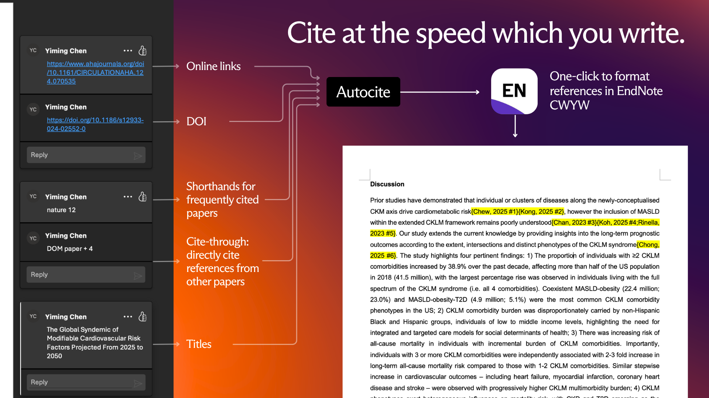
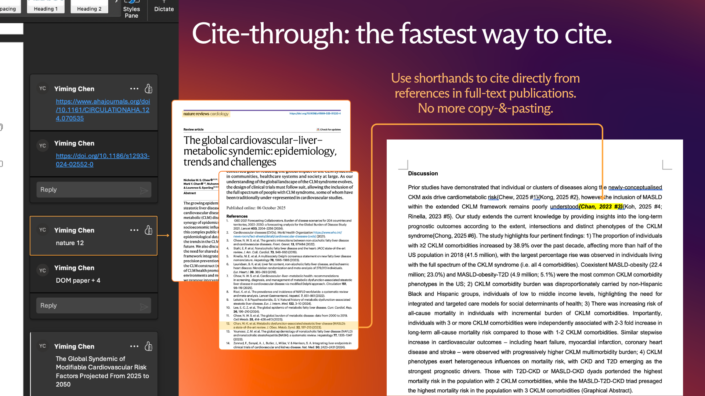

# _Autocite_ is the fastest way to cite, using shorthands

Autocite is a portable LLM agent skill that converts Word comments into verified EndNote CWYW citations like `{Smith, 2024 #123}`, in a single click, directly in your manuscript file.

Invoke `/autocite` followed by the following
1. Path to the manuscript file
2. _(Optional)_ Path to a folder with full-text publications to use *shorthands* and *cite-through*
3. _(Optional)_ Any additional instructions, for example
  - Only cite comments by specific author(s)
  - Do not cite comments by specific author(s)
  - Only cite comments in the Introduction and Discussion sections 
  - Only cite comments before / after a specific date

Only high or moderate confidence citations are inserted. Low-confidence, ambiguous, unresolved, or disputed references are returned in the audit workbook only.

An example prompt:
```text
/autocite 
path/tomanuscript.docx
my articles ./papers
only cite for Jane Smith's comments
```

This creates a run folder and stops before manuscript editing until EndNote record numbers are verified.

## Comments Autocite can read

Autocite reads Word comment text, author and metadata, and the surrounding context to determine what citation is required.
Autocite can recognise and create citations from any of the following formats:

### 1. Shorthands:
```text
JACC
Nature
Chen
```
Where ```JACC```; ```Nature```; ```Chen``` are code terms, corresponding to PDFs with filenames containing, or exactly are, these terms. 

### 2. Cite-thorugh shorthands: 
```text
Nature 12
```
This refers to the the 12th reference in the full-text PDF paper with the filename containing, or exactly is, the code `Nature`.

```text
Nature + 12, JACC 5-7
```
This refers to the paper encoded `Nature`, and
the 12th reference in the full-text PDF paper with encoded `Nature`, and
the 5th to 7th reference in the full-text PDF paper encoded `JACC`.



### 3. DOI: 
```text
DOI 10.1161/CIRCULATIONAHA.123.000000
```
or
```text
https://doi.org/10.1000/example
```

### 4. Direct PMID:
```text
PMID 12345678
```

### 5. Partial citation:
```text
Smith 2024, Circulation, cardiovascular prevention trial
```

### 6. Partial or full article title, or link to online publication:
```text
Long-term cardiovascular outcomes after intensive blood pressure control
https://www.ahajournals.org/doi/full/10.1161/CIRCULATIONAHA.124.070535
```

## Instructions you can give

You can scope the run by comment author:

```text
Only cite for Dr Jane Smith's comments.
Only process comments by Dr Lee.
Ignore comments by Dr John Doe.
```

You can scope the run by Word comment date. Use `YYYY-MM-DD` dates to avoid ambiguity:

```text
Only process comments after 2026-01-01.
Only process comments before 2026-03-31.
Only process comments from 2026-01-01 to 2026-03-31.
```

You can also give safety instructions:
```text
Use the PDFs in ./papers as source papers.
Use this EndNote template .enl and .Data folder.
Prepare the candidate map only, do not edit the manuscript yet.
Report low-confidence matches without inserting them.
```

By default, Autocite processes all Word comments unless you explicitly narrow the scope. When running the scripts manually, `docx_comment_audit.py` still extracts all comments. Apply author or date scope when selecting rows for candidate mapping, reconciliation, and insertion.

## How citations are found

Autocite uses a conservative search cascade. PubMed, Crossref, OpenAlex, and PDFs help identify the right publication.

Step by step:

1. Autocite reads every in-scope Word comment.

2. Autocite resolves shorthands and cite-through instructions from local PDFs. For example,
   - If you provide a `papers` folder, Autocite builds a paper-code index from PDF filenames.
   - `Nature` can refer to the source PDF coded as `Nature`.
   - `Nature 12` can refer to the 12th reference inside that source PDF.
   - `Nature + 12` can refer to both the `Nature` source PDF and its 12th reference.
   - PDF reference lists are extracted with `pdftotext` (installed on first run if absent on device).

3. Autocite searches EndNote when a usable title, DOI, PMID, or citation string is available.
   - Exact DOI, PMID, title, author, and year matches are preferred.
   - If a first EndNote search fails, Autocite tries cleaned, punctuation-stripped or partial title searches before marking the reference unresolved.

4. If PubMed MCP is available, Autocite prioritises it for PubMed lookup.
   - DOI and PMID lookups are preferred.
   - Title plus author or year searches are used when DOI or PMID is missing.
   - Any PubMed result must still match the intended title, first author, year, DOI, or PMID.

5. If PubMed MCP is not available, Autocite uses public lookup fallbacks.
   - NCBI E-utilities for PubMed search, PMID validation, and PubMed metadata.
   - Crossref REST API for DOI metadata.
   - OpenAlex as a fallback or enrichment source.

6. If a reference is found outside EndNote, Autocite prepares it for EndNote.
   - PubMed records may be imported as NBIB or RIS.
   - DOI-confirmed records may be written as RIS.
   - Local PDF or manually verified citation text may be written as RIS only when title, first author, and year are verified.

7. Autocite reads the final EndNote library back before insertion.
   - The final `{Author, Year #RecordNumber}` citation is created only after the record exists in the real `.enl` and `.Data/sdb/sdb.eni`.
   - The `#RecordNumber` must come from EndNote.

8. Autocite reconciles candidates and assigns confidence.
   - `high`: DOI, PMID, or exact title, author, and year match.
   - `moderate`: strong title and context match, with minor uncertainty.
   - `low`: ambiguous, unresolved, disputed, missing source, weak match, or failed EndNote confirmation.

Only `high` and `moderate` references are inserted into the manuscript. `low` confidence references are reported in the audit workbook.

## What Autocite returns

When the full workflow completes, Autocite returns:

1. An edited `.docx` with verified EndNote temporary citations inserted.
2. A backup copy of the original `.docx`.
3. `reference-citation-audit.xlsx`, with exactly two sheets:
   - `Excluded Comments`
   - `Resolved Comments`
4. JSON and CSV logs for comment extraction, paper-code mapping, candidate references, EndNote record numbers, insertion, and verification.
5. `status.json`, which records the run state.

Only high or moderate confidence citations are inserted. Low-confidence, ambiguous, unresolved, or disputed references are returned in the audit workbook only.

If EndNote is not ready, Autocite stops before editing the manuscript and returns the run folder with status `awaiting_endnote`.

## Requirements

Required:

1. Python 3.10 or later.
2. Python packages in `requirements.txt`.
3. `pdftotext`, provided by Poppler, for extracting reference lists from PDFs.
4. EndNote desktop, or a valid EndNote `.enl` plus matching `.Data` template.

Optional:

1. PubMed MCP, when running inside an agent environment that supports MCP tools.
2. LibreOffice, for optional DOCX to PDF verification.

## Installation

Clone or download this repository, then run:

```bash
cd autocite-workflow
python3 scripts/ensure_dependencies.py
```

The preflight script installs missing Python packages from `requirements.txt`. It also checks for `pdftotext`; when a supported package manager is available, it attempts to install Poppler automatically.

To install Autocite as an agent skill:

```bash
bash scripts/install.sh --codex
bash scripts/install.sh --claude
bash scripts/install.sh --all
```

Useful installer checks:

```bash
python3 scripts/validate_package.py
python3 scripts/install_codex_skill.py --dry-run
python3 scripts/install_claude_skill.py --dry-run
```

The installers validate the package, then copy the workflow into the target skills folder:

1. Codex: `$CODEX_HOME/skills/autocite` or `~/.codex/skills/autocite`.
2. Claude Code: `$CLAUDE_HOME/skills/autocite` or `~/.claude/skills/autocite`.

Generated files, tests, `.git`, `.DS_Store`, `__pycache__`, and `.pyc` files are excluded from installed skill copies.

Manual alternatives:

```bash
python3 -m pip install -r requirements.txt
```

macOS:

```bash
brew install poppler
```

Debian or Ubuntu:

```bash
sudo apt-get install -y poppler-utils
```

## First Run Check

Before the first workflow run on a machine:

```bash
python3 scripts/ensure_dependencies.py
```

To check without installing:

```bash
python3 scripts/ensure_dependencies.py --check-only
```

If `pdftotext` cannot be installed automatically, install Poppler with your operating system package manager and rerun the check.

## One-Command Early Run

To extract manuscript comments and prepare candidate references (command-line only; first deterministic section of the workflow), run:
```bash
python3 scripts/autocite_run.py \
  --docx "/path/to/manuscript.docx" \
  --papers-dir "/path/to/papers"
```

If no output folder is supplied, it creates:

```text
<manuscript_dir>/autocite-runs/<docx-stem>.<YYYYMMDD-HHMMSS>/
```

This launcher runs:

1. Dependency check with `scripts/ensure_dependencies.py`.
2. Word comment extraction with `scripts/docx_comment_audit.py`.
3. PDF reference extraction with `scripts/extract_pdf_references.py`, when `--papers-dir` is supplied.
4. Deterministic candidate template creation with `scripts/generate_candidate_template.py`.
5. Status updates through `scripts/run_status.py`.

It stops at `awaiting_endnote`. It does not create the EndNote library, insert citations, or edit the manuscript.

Useful variants:

```bash
python3 scripts/autocite_run.py \
  --docx "/path/to/manuscript.docx" \
  --out-dir run

python3 scripts/autocite_run.py \
  --docx "/path/to/manuscript.docx" \
  --papers-dir "/path/to/papers" \
  --skip-dependency-check
```

## Basic Usage

Create a run folder, then extract comments:

```bash
mkdir -p run
python3 scripts/docx_comment_audit.py \
  --docx "/path/to/manuscript.docx" \
  --out-dir run
```

If you have a folder of source PDFs:

```bash
python3 scripts/extract_pdf_references.py \
  --papers-dir "/path/to/papers" \
  --out-dir run
```

Create the deterministic candidate template:

```bash
python3 scripts/generate_candidate_template.py \
  --comments run/comments.json \
  --out-dir run
```

Then follow `references/reference-add-workflow.md` for EndNote library preparation, candidate reconciliation, insertion, verification, and audit workbook creation.

## PubMed And DOI Lookup

If PubMed MCP is configured in your agent environment, the workflow may use it for PubMed lookup.

If PubMed MCP is not available, use the built-in fallback:

1. NCBI E-utilities for PubMed search, PMID validation, and PubMed metadata.
2. Crossref REST API for DOI metadata when PubMed does not resolve the DOI.
3. OpenAlex as a fallback or enrichment layer.

Examples:

```bash
python3 scripts/reference_lookup.py --pmid 12345678
python3 scripts/reference_lookup.py --doi "10.1000/example"
python3 scripts/reference_lookup.py --title "Example cardiovascular trial" --author Smith --year 2024
```

Write lookup results to JSON or RIS:

```bash
python3 scripts/reference_lookup.py \
  --doi "10.1000/example" \
  --out-json run/reference_lookup.json \
  --out-ris run/reference_lookup.ris
```

## EndNote Requirement

This workflow does not use an EndNote MCP.

It requires either:

1. EndNote desktop to create or open a real `.enl` library with its matching `.Data` folder.
2. A valid existing EndNote template pair:
   - `.enl`
   - `.Data`

The final record number must come from the actual EndNote library. Do not insert a citation unless the `#RecordNumber` exists in the final `.enl` and `.Data/sdb/sdb.eni`.

## Run Status

Each run may maintain a machine-readable status sidecar:

```text
<run_dir>/status.json
```

Write or read it with:

```bash
python3 scripts/run_status.py --run-dir run --state extracting_comments --step docx_comment_audit
python3 scripts/run_status.py --run-dir run --read
```

Valid states include:

```text
created
checking_dependencies
extracting_comments
extracting_pdfs
preparing_endnote
resolving_candidates
awaiting_endnote
inserting_citations
verifying
writing_audit
completed
failed
cancelled
```

This makes interrupted runs easier to inspect, resume, or debug.

## Output Safety

Workflow outputs are written through temporary files before replacing the final path. This reduces the risk of half-written files when a run is interrupted.

The shared helper is `scripts/io_utils.py`. It is used for JSON, CSV, RIS, status, copied DOCX backups, EndNote template copies, and the audit workbook output.

## Outputs

The main user-facing output is:

```text
reference-citation-audit.xlsx
```

It must contain exactly two sheets:

1. `Excluded Comments`
2. `Resolved Comments`

Low-confidence or unresolved comments are reported only. Only high or moderate confidence citations are inserted.
